# 🏗️ Архитектура Super AI RU

> **Документ:** Architecture Design Document (ADOC)
> **Проект:** Российский аналог Abacus.ai
> **Версия:** 1.0
> **Статус:** Черновик

---

## Оглавление

1. [Architecture Overview](#1-architecture-overview)
2. [System Components](#2-system-components)
3. [Data Flow](#3-data-flow)
4. [Database Schema](#4-database-schema)
5. [API Design](#5-api-design)
6. [Security Model](#6-security-model)
7. [Scaling Strategy](#7-scaling-strategy)
8. [Deployment Architecture](#8-deployment-architecture)
9. [Monitoring & Observability](#9-monitoring--observability)

---

## 1. Architecture Overview

### C4 — Контекстная диаграмма (Level 1)

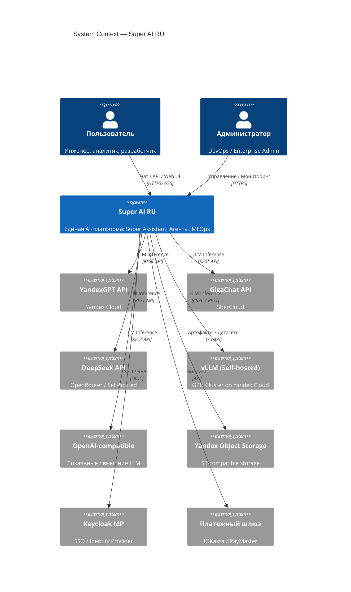
```mermaid
C4Context
  title System Context — Super AI RU

  Person(user, "Пользователь", "Инженер, аналитик, разработчик")
  Person(admin, "Администратор", "DevOps / Enterprise Admin")

  System(superAI, "Super AI RU", "Единая AI-платформа: Super Assistant, Агенты, MLOps")

  System_Ext(yandexGPT, "YandexGPT API", "Yandex Cloud")
  System_Ext(gigaChat, "GigaChat API", "SberCloud")
  System_Ext(deepseek, "DeepSeek API", "OpenRouter / Self-hosted")
  System_Ext(vllm, "vLLM (Self-hosted)", "GPU Cluster on Yandex Cloud")
  System_Ext(openaiCompat, "OpenAI-compatible", "Локальные / внешние LLM")

  System_Ext(s3, "Yandex Object Storage", "S3-compatible storage")
  System_Ext(keycloak, "Keycloak IdP", "SSO / Identity Provider")
  System_Ext(cloudPay, "Платежный шлюз", "ЮKassa / PayMaster")

  Rel(user, superAI, "Чат / API / Web UI", "HTTPS/WSS")
  Rel(admin, superAI, "Управление / Мониторинг", "HTTPS")
  Rel(superAI, yandexGPT, "LLM Inference", "REST API")
  Rel(superAI, gigaChat, "LLM Inference", "REST API")
  Rel(superAI, deepseek, "LLM Inference", "REST API")
  Rel(superAI, vllm, "LLM Inference", "gRPC / REST")
  Rel(superAI, openaiCompat, "LLM Inference", "REST API")
  Rel(superAI, s3, "Артефакты / Датасеты", "S3 API")
  Rel(superAI, keycloak, "SSO / RBAC", "OIDC")
  Rel(superAI, cloudPay, "Биллинг", "API")
```

### Краткое описание

Super AI RU — это распределённая микросервисная платформа, предоставляющая:

- **Super Assistant** — единый чат-интерфейс ко всем поддерживаемым LLM (российским и open-source)
- **Agent Platform** — конструктор AI-агентов на базе CrewAI с визуальным построением пайплайнов
- **RAG Engine** — Retrieval-Augmented Generation с поддержкой множественных источников знаний
- **MLOps** — AutoML, Fine-tuning, Model Registry, мониторинг моделей
- **GenAI Studio** — генерация контента (изображения, видео, код)

Платформа разворачивается в **Yandex Cloud** на Managed Kubernetes с использованием GPU-кластеров для инференса LLM.

---

## 2. System Components

### 2.1 Frontend (Next.js + React + SSE Streaming)

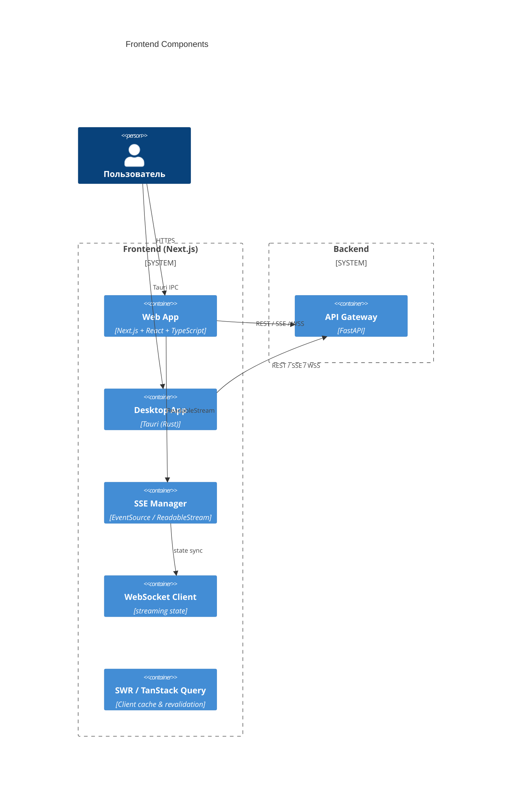
```mermaid
C4Container
  title Frontend Components

  Person(user, "Пользователь")

  System_Boundary(frontend, "Frontend (Next.js)") {
    Container(web, "Web App", "Next.js + React + TypeScript")
    Container(desktop, "Desktop App", "Tauri (Rust)")
    Container(sse, "SSE Manager", "EventSource / ReadableStream")
    Container(ws, "WebSocket Client", "streaming state")
    Container(cache, "SWR / TanStack Query", "Client cache & revalidation")
  }

  System_Boundary(backend, "Backend") {
    Container(gateway, "API Gateway", "FastAPI")
  }

  Rel(user, web, "HTTPS")
  Rel(user, desktop, "Tauri IPC")
  Rel(web, gateway, "REST / SSE / WSS")
  Rel(desktop, gateway, "REST / SSE / WSS")
  Rel(web, sse, "ReadableStream")
  Rel(sse, ws, "state sync")
```

**Ключевые особенности:**

- **Next.js App Router** — SSR для SEO-страниц, CSR для чата и дашбордов
- **SSE Streaming** — Server-Sent Events для поточного вывода токенов LLM (через `ReadableStream`)
- **Tauri Desktop** — нативный клиент на Rust с offline-режимом
- **TanStack Query** — оптимистичные обновления, кеширование, инвалидация
- **Monaco Editor** — встроенный редактор кода для Agent Builder

### 2.2 API Gateway (FastAPI + LiteLLM)

```mermaid
C4Container
  title API Gateway

  Container(gateway, "API Gateway", "FastAPI + LiteLLM")
  Container(rateLimiter, "Rate Limiter", "Redis + Token Bucket")
  Container(authMiddleware, "Auth Middleware", "JWT Verification")
  Container(litellm, "LiteLLM Router", "LLM Provider Abstraction")
  Container(router, "Request Router", "Service Discovery")

  Rel(gateway, rateLimiter, "check limits")
  Rel(gateway, authMiddleware, "verify JWT")
  Rel(gateway, litellm, "route to LLM")
  Rel(gateway, router, "route to services")
  Rel(rateLimiter, "Redis", "rate data")
  Rel(authMiddleware, "Keycloak", "OIDC introspection")
```

**FastAPI Gateway** — единая точка входа, реализует:

- Аутентификация и авторизация (JWT + OIDC)
- Rate limiting (token bucket на Redis)
- Маршрутизация запросов к микросервисам
- Агрегация логов и метрик
- **LiteLLM** — универсальный адаптер для всех LLM-провайдеров (100+ моделей)

### 2.3 LLM Router

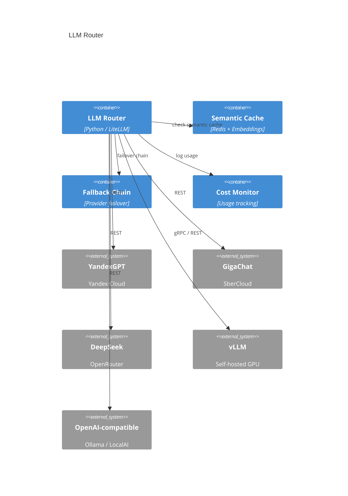
```mermaid
C4Container
  title LLM Router

  Container(router, "LLM Router", "Python / LiteLLM")
  Container(cache, "Semantic Cache", "Redis + Embeddings")
  Container(fallback, "Fallback Chain", "Provider failover")
  Container(monitor, "Cost Monitor", "Usage tracking")

  System_Ext(ygpt, "YandexGPT", "Yandex Cloud")
  System_Ext(gc, "GigaChat", "SberCloud")
  System_Ext(ds, "DeepSeek", "OpenRouter")
  System_Ext(vllm, "vLLM", "Self-hosted GPU")
  System_Ext(oai, "OpenAI-compatible", "Ollama / LocalAI")

  Rel(router, cache, "check semantic cache")
  Rel(router, fallback, "failover chain")
  Rel(router, monitor, "log usage")
  Rel(router, ygpt, "REST")
  Rel(router, gc, "REST")
  Rel(router, ds, "REST")
  Rel(router, vllm, "gRPC / REST")
  Rel(router, oai, "REST")
```

**Провайдеры:**

| Провайдер | Тип доступа | Модели | Локализация |
|-----------|-------------|--------|-------------|
| YandexGPT | API (Yandex Cloud) | YandexGPT Lite/Pro, YandexART | РФ, 152-ФЗ |
| GigaChat | API (SberCloud) | GigaChat Pro/Lite | РФ, 152-ФЗ |
| DeepSeek | API / Self-hosted | DeepSeek-V3, Coder | Китай / РФ |
| vLLM | Self-hosted GPU | Llama, Qwen, Mistral, Nemo | Локально |
| OpenAI-compat | External | Любые open-source модели | Локально |

### 2.4 RAG Engine (LangChain/LlamaIndex + Qdrant + Text Embeddings)

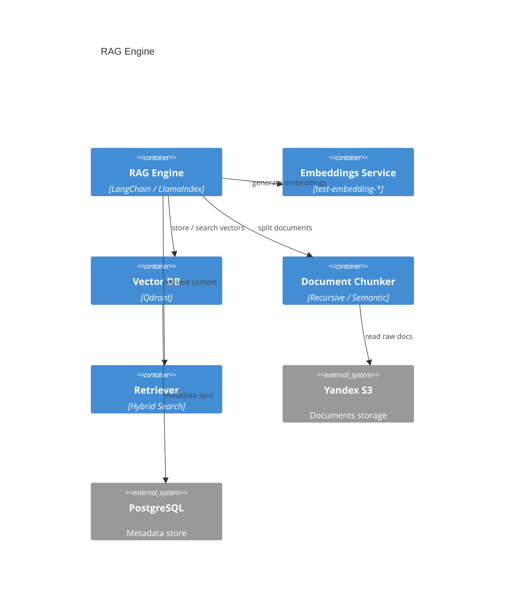
```mermaid
C4Container
  title RAG Engine

  Container(rag, "RAG Engine", "LangChain / LlamaIndex")
  Container(embeddings, "Embeddings Service", "text-embedding-*")
  Container(qdrant, "Vector DB", "Qdrant")
  Container(chunker, "Document Chunker", "Recursive / Semantic")
  Container(retriever, "Retriever", "Hybrid Search")

  System_Ext(s3, "Yandex S3", "Documents storage")
  System_Ext(pg, "PostgreSQL", "Metadata store")

  Rel(rag, embeddings, "generate embeddings")
  Rel(rag, qdrant, "store / search vectors")
  Rel(rag, chunker, "split documents")
  Rel(rag, retriever, "retrieve context")
  Rel(chunker, s3, "read raw docs")
  Rel(qdrant, pg, "metadata sync")
```

**RAG Pipeline:**

```
Document Upload → Chunking (RecursiveCharacterTextSplitter)
                → Embedding (ruBERT / E5-mistral / intfloat)
                → Qdrant Indexing (HNSW)
                → User Query → Query Embedding → Hybrid Search (Vector + BM25)
                → Context Assembly → LLM Prompt Injection
```

**Поддерживаемые форматы:** PDF, DOCX, TXT, HTML, Markdown, CSV, JSON, изображения (OCR), аудио (ASR).

**Embedding-модели:**
- `intfloat/multilingual-e5-large` — мультиязычная (рекомендуемая)
- `sentence-transformers/paraphrase-multilingual-MiniLM-L12-v2` — лёгкая
- `RuBERT` от DeepPavlov — оптимизирована под русский язык

### 2.5 Agent Runtime (CrewAI + самописный оркестратор)

```mermaid
C4Container
  title Agent Runtime

  Container(crew, "Agent Orchestrator", "CrewAI + Python")
  Container(registry, "Agent Registry", "PostgreSQL")
  Container(scheduler, "Task Scheduler", "Celery + Redis")
  Container(tools, "Tool Executor", "Docker sandbox")
  Container(memory, "Agent Memory", "PostgreSQL + Redis")

  Rel(crew, registry, "load agents")
  Rel(crew, scheduler, "schedule tasks")
  Rel(crew, tools, "execute tools")
  Rel(crew, memory, "persist state")
  Rel(scheduler, "Redis", "task queue")
  Rel(tools, "Docker", "sandbox containers")
```

**Архитектура агентов:**

```
User Prompt
  ↓
Agent Orchestrator (CrewAI)
  ├── Router Agent — определяет, какой агент/crew запустить
  ├── Research Agent — RAG + Web Search
  ├── Code Agent — генерация и исполнение кода (sandbox)
  ├── Data Agent — анализ данных, визуализация
  ├── GenAI Agent — генерация изображений/видео
  └── Supervisor Agent — контроль качества, валидация
  ↓
Tool Executor (Docker sandbox)
  ↓
Response Assembly → Streaming to Frontend
```

### 2.6 Auth Service (Keycloak + JWT)

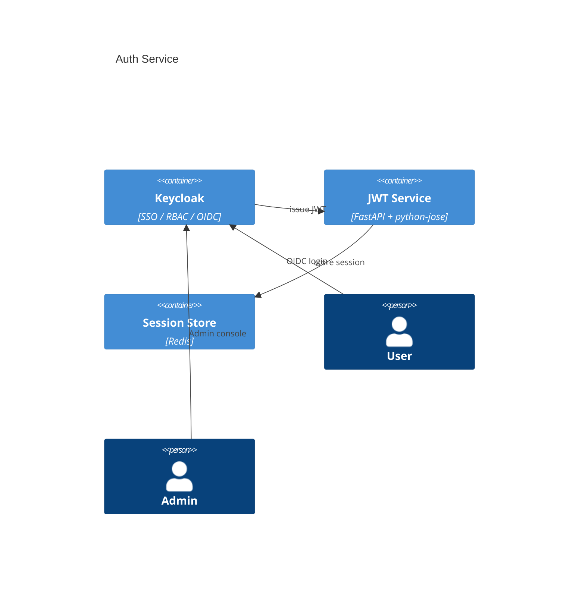
```mermaid
C4Container
  title Auth Service

  Container(keycloak, "Keycloak", "SSO / RBAC / OIDC")
  Container(jwt, "JWT Service", "FastAPI + python-jose")
  Container(session, "Session Store", "Redis")

  Person(user, "User")
  Person(admin, "Admin")

  Rel(user, keycloak, "OIDC login")
  Rel(admin, keycloak, "Admin console")
  Rel(keycloak, jwt, "issue JWT")
  Rel(jwt, session, "store session")
```

**Возможности:**
- SSO через OIDC/SAML
- RBAC (Admin, Developer, Viewer, Billing Admin)
- MFA (TOTP)
- Соответствие 152-ФЗ: логирование доступа, шифрование ПДн
- Self-service: регистрация, восстановление пароля, управление API-ключами
- Интеграция с корпоративными IdP (AD, LDAP, Keycloak Social)

### 2.7 Billing Service

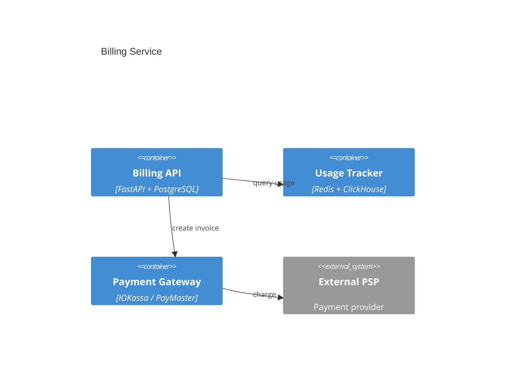
```mermaid
C4Container
  title Billing Service

  Container(billing, "Billing API", "FastAPI + PostgreSQL")
  Container(tracker, "Usage Tracker", "Redis + ClickHouse")
  Container(payments, "Payment Gateway", "ЮKassa / PayMaster")

  System_Ext(cloudPay, "External PSP", "Payment provider")

  Rel(billing, tracker, "query usage")
  Rel(billing, payments, "create invoice")
  Rel(payments, cloudPay, "charge")
```

**Модель тарификации:**
- **Pay-per-token** — $/1M токенов (разные цены для разных моделей)
- **Subscription** — месячный план с квотой токенов
- **Enterprise** — кастомные тарифы, выделенные GPU
- **Credit-based** — покупка пакетов кредитов

---

## 3. Data Flow

### Sequence Diagram: Запрос пользователя → Ответ LLM

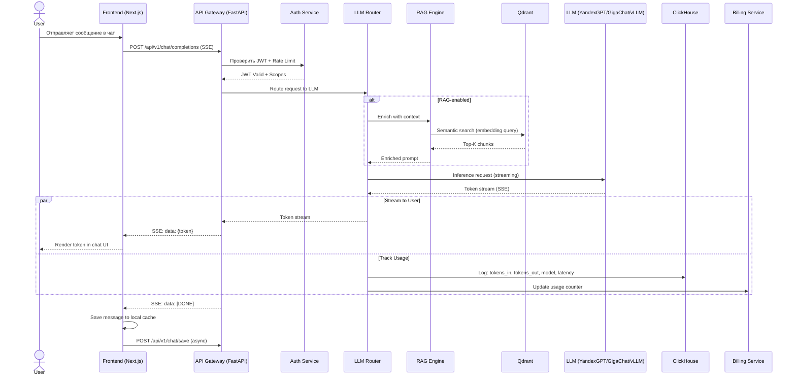
```mermaid
sequenceDiagram
    actor U as User
    participant F as Frontend (Next.js)
    participant G as API Gateway (FastAPI)
    participant A as Auth Service
    participant R as LLM Router
    participant RG as RAG Engine
    participant Q as Qdrant
    participant L as LLM (YandexGPT/GigaChat/vLLM)
    participant C as ClickHouse
    participant B as Billing Service

    U->>F: Отправляет сообщение в чат
    F->>G: POST /api/v1/chat/completions (SSE)

    G->>A: Проверить JWT + Rate Limit
    A-->>G: JWT Valid + Scopes

    G->>R: Route request to LLM

    alt RAG-enabled
        R->>RG: Enrich with context
        RG->>Q: Semantic search (embedding query)
        Q-->>RG: Top-K chunks
        RG-->>R: Enriched prompt
    end

    R->>L: Inference request (streaming)
    L-->>R: Token stream (SSE)

    par Stream to User
        R-->>G: Token stream
        G-->>F: SSE: data: {token}
        F-->>U: Render token in chat UI
    and Track Usage
        R->>C: Log: tokens_in, tokens_out, model, latency
        R->>B: Update usage counter
    end

    G-->>F: SSE: data: [DONE]
    F->>F: Save message to local cache
    F->>G: POST /api/v1/chat/save (async)
```

### Альтернативный flow: Агент с инструментами

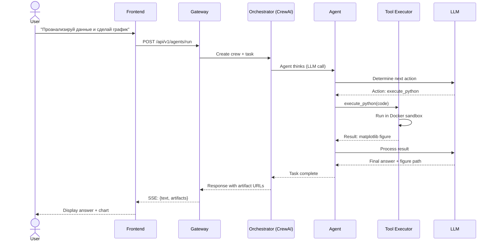
```mermaid
sequenceDiagram
    actor U as User
    participant F as Frontend
    participant G as Gateway
    participant O as Orchestrator (CrewAI)
    participant A as Agent
    participant T as Tool Executor
    participant L as LLM

    U->>F: "Проанализируй данные и сделай график"
    F->>G: POST /api/v1/agents/run
    G->>O: Create crew + task

    O->>A: Agent thinks (LLM call)
    A->>L: Determine next action
    L-->>A: Action: execute_python

    A->>T: execute_python(code)
    T->>T: Run in Docker sandbox
    T-->>A: Result: matplotlib figure

    A->>L: Process result
    L-->>A: Final answer + figure path

    A-->>O: Task complete
    O-->>G: Response with artifact URLs
    G-->>F: SSE: {text, artifacts}
    F-->>U: Display answer + chart
```

---

## 4. Database Schema

### 4.1 PostgreSQL (Primary OLTP)

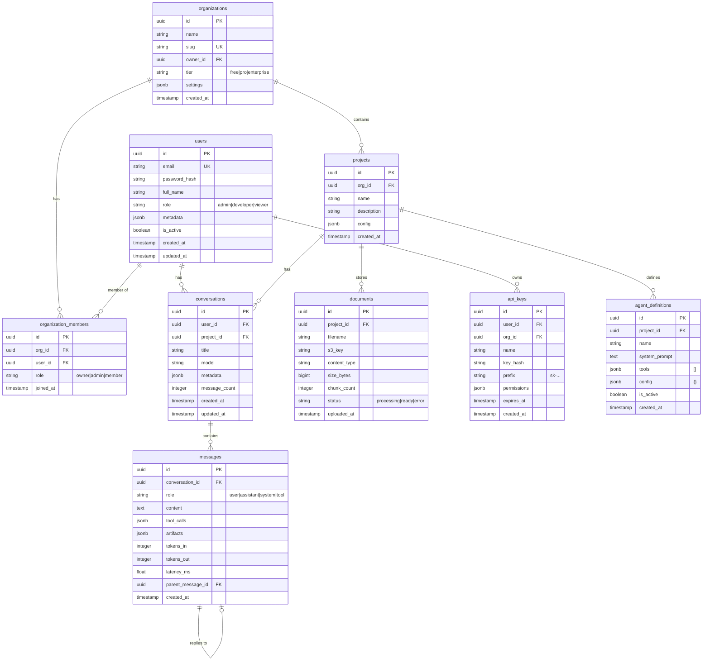
```mermaid
erDiagram
    users {
        uuid id PK
        string email UK
        string password_hash
        string full_name
        string role "admin|developer|viewer"
        jsonb metadata
        boolean is_active
        timestamp created_at
        timestamp updated_at
    }

    organizations {
        uuid id PK
        string name
        string slug UK
        uuid owner_id FK
        string tier "free|pro|enterprise"
        jsonb settings
        timestamp created_at
    }

    organization_members {
        uuid id PK
        uuid org_id FK
        uuid user_id FK
        string role "owner|admin|member"
        timestamp joined_at
    }

    projects {
        uuid id PK
        uuid org_id FK
        string name
        string description
        jsonb config
        timestamp created_at
    }

    conversations {
        uuid id PK
        uuid user_id FK
        uuid project_id FK
        string title
        string model
        jsonb metadata
        integer message_count
        timestamp created_at
        timestamp updated_at
    }

    messages {
        uuid id PK
        uuid conversation_id FK
        string role "user|assistant|system|tool"
        text content
        jsonb tool_calls
        jsonb artifacts
        integer tokens_in
        integer tokens_out
        float latency_ms
        uuid parent_message_id FK
        timestamp created_at
    }

    documents {
        uuid id PK
        uuid project_id FK
        string filename
        string s3_key
        string content_type
        bigint size_bytes
        integer chunk_count
        string status "processing|ready|error"
        timestamp uploaded_at
    }

    api_keys {
        uuid id PK
        uuid user_id FK
        uuid org_id FK
        string name
        string key_hash
        string prefix "sk-..."
        jsonb permissions
        timestamp expires_at
        timestamp created_at
    }

    agent_definitions {
        uuid id PK
        uuid project_id FK
        string name
        text system_prompt
        jsonb tools "[]"
        jsonb config "{}"
        boolean is_active
        timestamp created_at
    }

    users ||--o{ conversations: "has"
    users ||--o{ api_keys: "owns"
    organizations ||--o{ organization_members: "has"
    organizations ||--o{ projects: "contains"
    users ||--o{ organization_members: "member of"
    projects ||--o{ conversations: "has"
    projects ||--o{ documents: "stores"
    projects ||--o{ agent_definitions: "defines"
    conversations ||--o{ messages: "contains"
    messages ||--o| messages: "replies to"
```

### 4.2 ClickHouse (OLAP — логи, метрики, аналитика)

```sql
-- Потребление токенов по пользователям/моделям
CREATE TABLE usage_logs (
    event_time DateTime,
    user_id UUID,
    org_id UUID,
    model String,
    provider String,
    tokens_in UInt32,
    tokens_out UInt32,
    latency_ms Float64,
    cost Float64,
    status String,
    error String
) ENGINE = MergeTree()
ORDER BY (event_time, org_id, model);

-- Метрики производительности API
CREATE TABLE api_metrics (
    event_time DateTime,
    endpoint String,
    method String,
    status_code UInt16,
    latency_ms Float64,
    user_id UUID,
    org_id UUID
) ENGINE = SummingMergeTree()
ORDER BY (event_time, endpoint, status_code);

-- Аггрегированная статистика по дням
CREATE MATERIALIZED VIEW daily_usage
ENGINE = SummingMergeTree()
ORDER BY (date, org_id, model)
AS SELECT
    toDate(event_time) AS date,
    org_id,
    model,
    sum(tokens_in) AS total_tokens_in,
    sum(tokens_out) AS total_tokens_out,
    count() AS request_count,
    avg(latency_ms) AS avg_latency,
    sum(cost) AS total_cost
FROM usage_logs
GROUP BY date, org_id, model;
```

### 4.3 Qdrant (Vector Store)

```yaml
# Коллекции в Qdrant
collections:
  - name: "documents"
    vectors:
      size: 1024         # E5-large embedding dimension
      distance: Cosine
    optimizers_config:
      default_segment_number: 2
      memmap_threshold_kb: 20000
    hnsw_config:
      m: 16
      ef_construct: 100
    payload_schema:
      document_id: keyword
      chunk_index: integer
      project_id: keyword
      text: text
      metadata: json

  - name: "conversation_memory"
    vectors:
      size: 1024
      distance: Cosine
    payload_schema:
      conversation_id: keyword
      message_id: keyword
      role: keyword
      text: text
      timestamp: datetime

  - name: "agent_memory"
    vectors:
      size: 1024
      distance: Cosine
    payload_schema:
      agent_id: keyword
      session_id: keyword
      type: keyword
      content: text
      timestamp: datetime
```

### 4.4 Redis (Cache + Pub/Sub + Queues)

| Ключ | Тип | TTL | Назначение |
|------|-----|-----|-----------|
| `rate_limit:{user_id}` | Sorted Set | 1 min | Rate limiting |
| `session:{session_id}` | Hash | 24h | Сессия пользователя |
| `cache:llm:{prompt_hash}` | String | 1h | Семантический кеш LLM |
| `cache:embedding:{text_hash}` | String | 24h | Кеш эмбеддингов |
| `ws:{conversation_id}` | Pub/Sub | — | WebSocket-каналы |
| `celery:{queue}` | List | — | Очередь задач Celery |

---

## 5. API Design

### 5.1 RESTful Endpoints

#### Chat / LLM

```http
# Streaming chat completion (SSE)
POST /api/v1/chat/completions
Authorization: Bearer <jwt>
Content-Type: application/json

{
  "model": "yandexgpt/pro",              // модель
  "messages": [
    {"role": "system", "content": "..."},
    {"role": "user", "content": "Привет!"}
  ],
  "stream": true,                         // SSE streaming
  "temperature": 0.7,
  "max_tokens": 4096,
  "rag": {                                // опционально: RAG
    "project_id": "uuid",
    "top_k": 5,
    "similarity_threshold": 0.75
  },
  "tools": [                              // опционально: инструменты
    {"type": "function", "function": {"name": "web_search", "parameters": {}}}
  ]
}

Response: SSE stream
  data: {"choices":[{"delta":{"content":"токен"}}]}
  ...
  data: [DONE]
```

```http
# Non-streaming completion
POST /api/v1/chat/completions
  → Response: {"id":"...", "choices":[{"message":{...}}], "usage":{...}}

# Get conversation history
GET /api/v1/chat/conversations/{conversation_id}/messages
  → Response: {"messages": [...], "total": 42}

# List conversations
GET /api/v1/chat/conversations?project_id=uuid&limit=50&offset=0
```

#### RAG / Documents

```http
# Upload document
POST /api/v1/documents/upload
Content-Type: multipart/form-data
  file: <binary>
  → Response: {"document_id": "uuid", "status": "processing"}

# Search documents (RAG)
POST /api/v1/rag/search
{
  "query": "строка поиска",
  "project_id": "uuid",
  "top_k": 10,
  "filter": {"document_type": "pdf"}
}
  → Response: {"results": [{"chunk_id": "...", "text": "...", "score": 0.95}]}
```

#### Agents

```http
# Create agent definition
POST /api/v1/agents
{
  "name": "Research Agent",
  "system_prompt": "...",
  "tools": ["web_search", "rag", "code_executor"],
  "model": "deepseek/v3",
  "temperature": 0.3
}
  → Response: {"agent_id": "uuid", "status": "created"}

# Run agent
POST /api/v1/agents/{agent_id}/run
{
  "task": "Проанализируй последние новости по AI",
  "stream": true
}
  → Response: SSE stream with intermediate agent thoughts + final answer
```

#### Billing

```http
GET /api/v1/billing/usage?start=2026-01-01&end=2026-07-09&granularity=day
  → Response: {"usage": [...], "total_cost": 1234.56}

POST /api/v1/billing/credits/purchase
{
  "amount": 5000,
  "currency": "RUB"
}
  → Response: {"invoice_id": "...", "payment_url": "..."}
```

#### Admin

```http
GET /api/v1/admin/users?limit=50&offset=0
GET /api/v1/admin/usage/summary
POST /api/v1/admin/models/register
DELETE /api/v1/admin/users/{user_id}
```

### 5.2 WebSocket / Session для Streaming

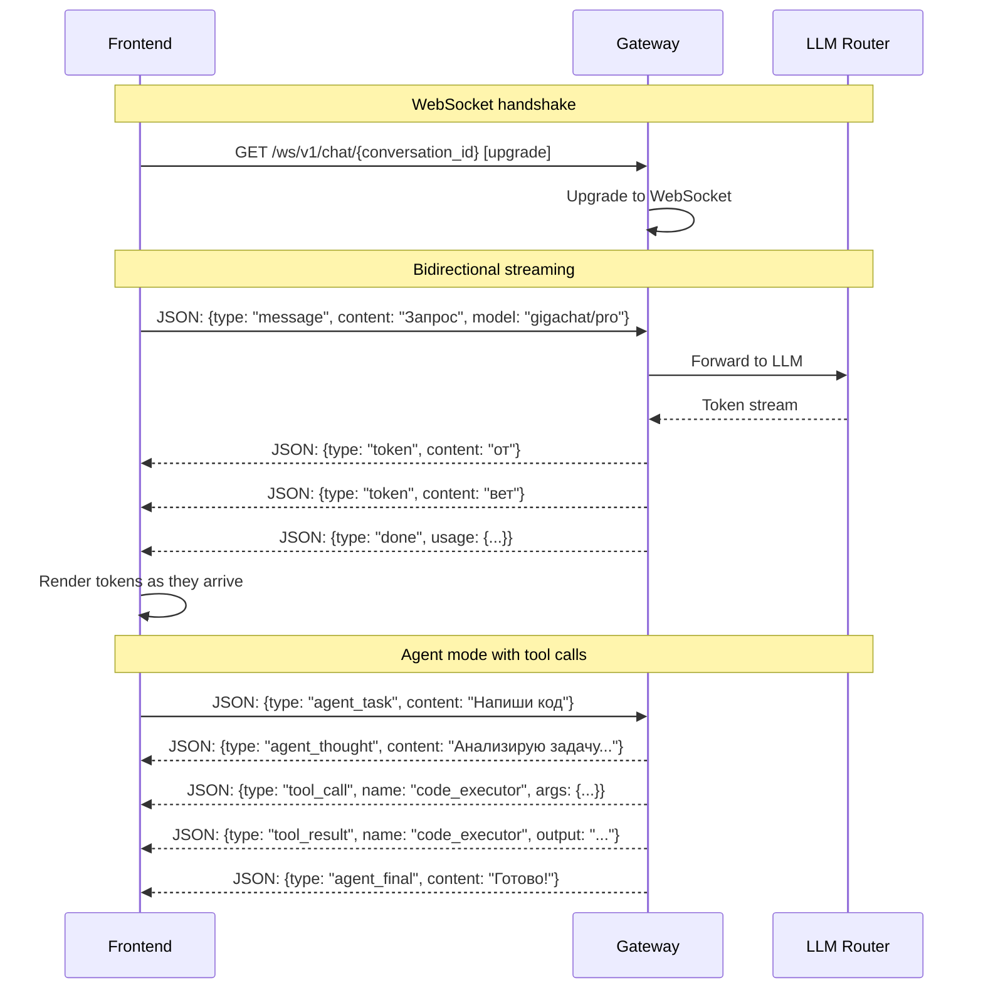
```mermaid
sequenceDiagram
    participant F as Frontend
    participant G as Gateway
    participant R as LLM Router

    Note over F,R: WebSocket handshake
    F->>G: GET /ws/v1/chat/{conversation_id} [upgrade]
    G->>G: Upgrade to WebSocket

    Note over F,R: Bidirectional streaming
    F->>G: JSON: {type: "message", content: "Запрос", model: "gigachat/pro"}
    G->>R: Forward to LLM
    R-->>G: Token stream
    G-->>F: JSON: {type: "token", content: "от"}
    G-->>F: JSON: {type: "token", content: "вет"}
    G-->>F: JSON: {type: "done", usage: {...}}
    F->>F: Render tokens as they arrive

    Note over F,R: Agent mode with tool calls
    F->>G: JSON: {type: "agent_task", content: "Напиши код"}
    G-->>F: JSON: {type: "agent_thought", content: "Анализирую задачу..."}
    G-->>F: JSON: {type: "tool_call", name: "code_executor", args: {...}}
    G-->>F: JSON: {type: "tool_result", name: "code_executor", output: "..."}
    G-->>F: JSON: {type: "agent_final", content: "Готово!"}
```

**Protocol: WebSocket JSON Messages**

| Тип сообщения | Направление | Описание |
|--------------|------------|----------|
| `message` | Client → Server | Текстовое сообщение пользователя |
| `token` | Server → Client | Очередной токен генерации |
| `done` | Server → Client | Завершение генерации |
| `error` | Server → Client | Ошибка |
| `agent_thought` | Server → Client | Промежуточная мысль агента |
| `tool_call` | Server → Client | Агент вызывает инструмент |
| `tool_result` | Server → Client | Результат выполнения инструмента |
| `agent_final` | Server → Client | Финальный ответ агента |
| `cancel` | Client → Server | Отмена генерации |
| `ping/pong` | Both | Keepalive |

---

## 6. Security Model

### 6.1 RBAC (Role-Based Access Control)

| Роль | Разрешения |
|------|-----------|
| **admin** | Всё: управление пользователями, моделями, биллингом, системными настройками |
| **developer** | CRUD проекты, агенты, RAG, вызов LLM, просмотр usage |
| **viewer** | Чтение проектов, чат с LLM (ограниченный), просмотр дашбордов |
| **billing_admin** | Управление подпиской, просмотр счетов, экспорт usage |

### 6.2 JWT + API Keys

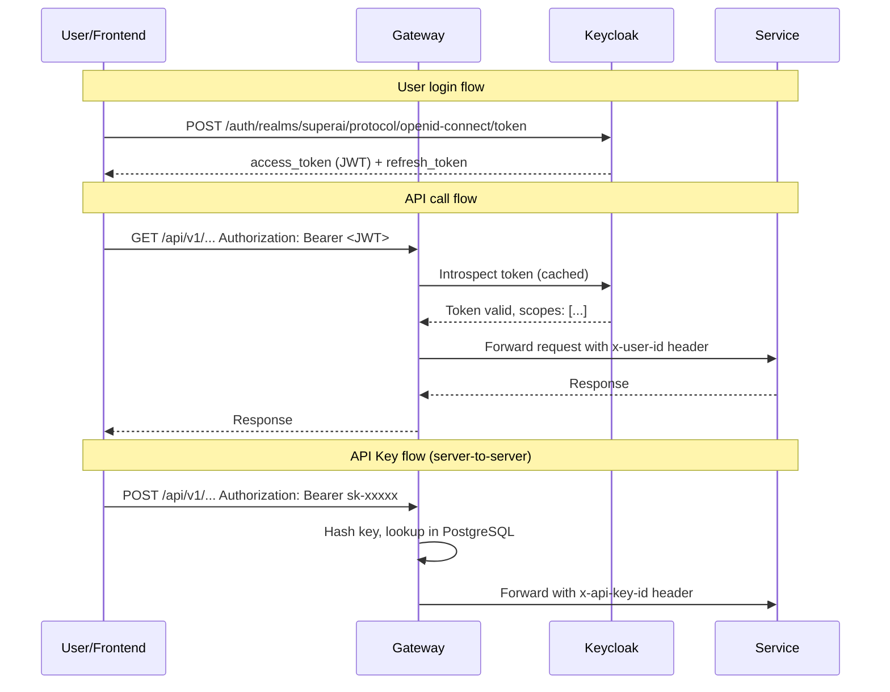
```mermaid
sequenceDiagram
    participant U as User/Frontend
    participant G as Gateway
    participant K as Keycloak
    participant S as Service

    Note over U,S: User login flow
    U->>K: POST /auth/realms/superai/protocol/openid-connect/token
    K-->>U: access_token (JWT) + refresh_token

    Note over U,S: API call flow
    U->>G: GET /api/v1/... Authorization: Bearer <JWT>
    G->>K: Introspect token (cached)
    K-->>G: Token valid, scopes: [...]
    G->>S: Forward request with x-user-id header
    S-->>G: Response
    G-->>U: Response

    Note over U,S: API Key flow (server-to-server)
    U->>G: POST /api/v1/... Authorization: Bearer sk-xxxxx
    G->>G: Hash key, lookup in PostgreSQL
    G->>S: Forward with x-api-key-id header
```

**JWT Claims:**
```json
{
  "sub": "user-uuid",
  "org_id": "org-uuid",
  "role": "developer",
  "permissions": ["chat:write", "agents:read", "rag:write"],
  "iat": 1700000000,
  "exp": 1700086400
}
```

### 6.3 Encryption at Rest

| Слой | Механизм |
|------|----------|
| **PostgreSQL** | TDE (Transparent Data Encryption) через Yandex Managed Postgres |
| **ClickHouse** | Шифрование на уровне дисков Yandex Cloud |
| **Qdrant** | Шифрование volume-разделов (dm-crypt / LUKS) |
| **S3 Object Storage** | Server-side encryption (SSE-S3 / SSE-KMS) |
| **Secrets** | Yandex Lockbox + HashiCorp Vault |
| **API Keys в БД** | bcrypt (или SHA-256 с солью) |

### 6.4 Соответствие 152-ФЗ

- **Локализация данных** — все серверы в РФ (Yandex Cloud, Москва / Владимир / Рязань)
- **Шифрование ПДн** — AES-256 для персональных данных в покое
- **Логирование доступа** — все операции чтения/записи ПДн логируются в ClickHouse на 3 года
- **Разграничение доступа** — RBAC + аудит
- **Уничтожение данных** — API для полного удаления пользователя и всех его данных
- **Согласие на обработку** — check-box при регистрации, запись в БД
- **Уведомление об утечках** — автоматический алерт в Роскомнадзор через API

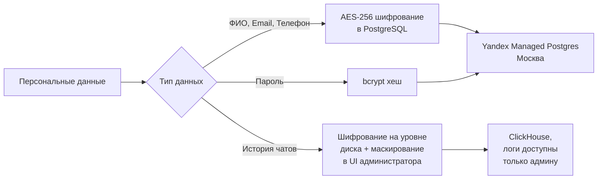
```mermaid
flowchart LR
    A[Персональные данные] --> B{Тип данных}
    B -->|ФИО, Email, Телефон| C[AES-256 шифрование\nв PostgreSQL]
    B -->|Пароль| D[bcrypt хеш]
    B -->|История чатов| E[Шифрование на уровне\nдиска + маскирование\nв UI администратора]

    C --> F[Yandex Managed Postgres\nМосква]
    D --> F
    E --> G[ClickHouse,\nлоги доступны\nтолько админу]
```

---

## 7. Scaling Strategy

### 7.1 Horizontal Scaling

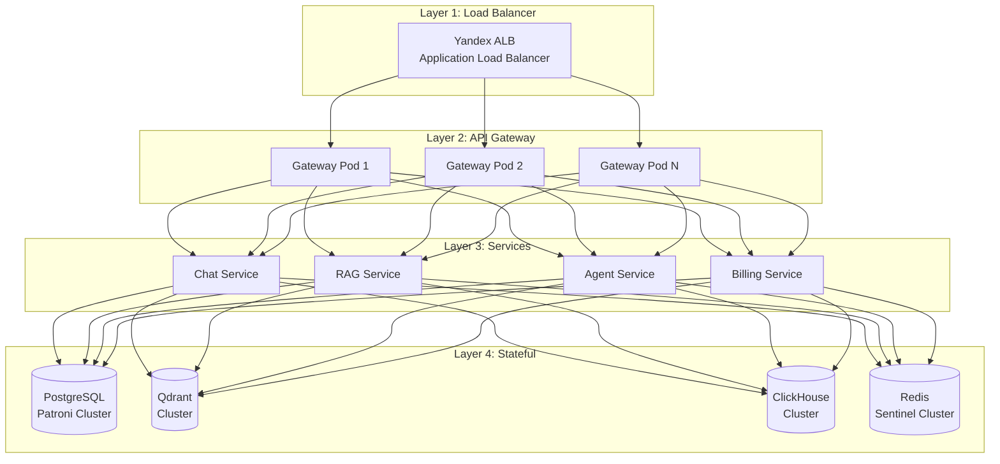
```mermaid
graph TB
    subgraph "Layer 1: Load Balancer"
        LB[Yandex ALB\nApplication Load Balancer]
    end

    subgraph "Layer 2: API Gateway"
        G1[Gateway Pod 1]
        G2[Gateway Pod 2]
        G3[Gateway Pod N]
    end

    subgraph "Layer 3: Services"
        CHAT[Chat Service]
        RAG[RAG Service]
        AGENT[Agent Service]
        BILL[Billing Service]
    end

    subgraph "Layer 4: Stateful"
        PG[(PostgreSQL\nPatroni Cluster)]
        QD[(Qdrant\nCluster)]
        CH[(ClickHouse\nCluster)]
        RD[(Redis\nSentinel Cluster)]
    end

    LB --> G1 & G2 & G3
    G1 & G2 & G3 --> CHAT & RAG & AGENT & BILL
    CHAT & RAG & AGENT & BILL --> PG & QD & CH & RD
```

**Ключевые решения:**

| Компонент | Стратегия | Механизм |
|-----------|-----------|----------|
| API Gateway | HPA по CPU + RPS | Horizontal Pod Autoscaler (K8s) |
| Chat Service | HPA по CPU + latency | K8s HPA |
| RAG Service | HPA по Qdrant QPS + CPU | K8s HPA |
| Agent Runtime | HPA по длине очереди Celery | K8s HPA + Celery Autoscaler |
| LiteLLM Router | HPA по RPS | K8s HPA |
| Billing | HPA по CPU | K8s HPA |
| PostgreSQL | Patroni Cluster (3 nodes) | Авто-фейловер, read replicas |
| Qdrant | Sharded cluster + replication | Qdrant native clustering |
| ClickHouse | Sharded cluster с репликацией | ClickHouse Keeper |
| Redis | Sentinel cluster | 3 sentinel + 1 master + N replicas |

### 7.2 GPU Scheduler

```mermaid
graph TB
    subgraph "GPU Cluster"
        GQ[GPU Queue\n(RabbitMQ / Redis)]
        S1[GPU Worker 1\nA100 80GB]
        S2[GPU Worker 2\nA100 80GB]
        S3[GPU Worker 3\nH100]
        S4[GPU Worker N\nL40S]
    end

    subgraph "vLLM Instances"
        V1[vLLM\nLlama-3.1-70B]
        V2[vLLM\nQwen-2.5-72B]
        V3[vLLM\nDeepSeek-Coder-V2]
        V4[vLLM\nMistral-Large]
    end

    GQ --> S1 & S2 & S3 & S4
    S1 --> V1
    S2 --> V2
    S3 --> V3
    S4 --> V4

    V1 & V2 & V3 & V4 --> LLMRouter[LLM Router\nLoad Balance per model]
```

**GPU Pool Management:**

```yaml
# GPU allocation strategy
models:
  - name: "llama-3.1-70b"
    gpu_type: A100-80GB
    min_instances: 1
    max_instances: 4
    scaling_metric: "queue_depth"      # autoscale when queue > 10
    batch_size: 32                     # dynamic batching
    
  - name: "qwen-2.5-72b"
    gpu_type: A100-80GB
    min_instances: 1
    max_instances: 3
    
  - name: "deepseek-coder-v2"
    gpu_type: H100
    min_instances: 1
    max_instances: 2
    
  - name: "mistral-nemo-12b"
    gpu_type: L40S
    min_instances: 2
    max_instances: 8
```

**Оптимизация GPU:**
- **PagedAttention** (vLLM) — эффективное управление KV-кэшем
- **Continuous batching** — обработка запросов по мере поступления
- **Quantization** — FP16/INT8/FP8 для уменьшения VRAM
- **Tensor parallelism** — распределение модели на несколько GPU
- **Speculative decoding** — ускорение инференса через draft model

### 7.3 Redis for Caching

| Кеш | Тип | Размер | TTL | Эффект |
|-----|-----|--------|-----|--------|
| Embedding cache | String→Vector | ~200 MB | 24h | -90% эмбеддинг запросов |
| LLM semantic cache | String→Tokens | ~1 GB | 1h | -30% повторных LLM вызовов |
| Session store | Hash | ~500 MB | 24h | — |
| Rate limiter | Sorted Set | ~100 MB | 1 min | — |
| Task queue | List | ~100 MB | — | — |

---

## 8. Deployment Architecture

### 8.1 Yandex Cloud Topology

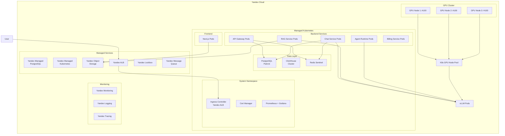
```mermaid
graph TB
    subgraph "Yandex Cloud"
        subgraph "Managed Kubernetes"
            subgraph "System Namespace"
                IG[Ingress Controller\nYandex ALB]
                CM[Cert Manager]
                MON[Prometheus + Grafana]
            end

            subgraph "Frontend"
                FE[Next.js Pods]
            end

            subgraph "Backend Services"
                GW[API Gateway Pods]
                CHAT[Chat Service Pods]
                RAG[RAG Service Pods]
                AGT[Agent Runtime Pods]
                BLL[Billing Service Pods]
            end

            subgraph "Data Layer"
                PG[PostgreSQL\nPatroni]
                CH[ClickHouse\nCluster]
                RD[Redis Sentinel]
            end
        end

        subgraph "GPU Cluster"
            GPU1[GPU Node 1: A100]
            GPU2[GPU Node 2: A100]
            GPU3[GPU Node 3: H100]
        end

        subgraph "Managed Services"
            YDB[Yandex Managed\nPostgreSQL]
            YMQ[Yandex Managed\nKubernetes]
            YS3[Yandex Object\nStorage]
            YLB[Yandex ALB]
            YLK[Yandex Lockbox]
            YMQ2[Yandex Message\nQueue]
        end

        subgraph "Monitoring"
            YM[Yandex Monitoring]
            YL[Yandex Logging]
            YT[Yandex Tracing]
        end

        YLB --> IG
        FE --> YS3
        GW --> PG & RD
        CHAT --> PG & RD
        RAG --> YS3

        GPU1 & GPU2 & GPU3 ----> K8sGPU[K8s GPU Node Pool]
        K8sGPU --> VLLM[vLLM Pods]
        CHAT & RAG & AGT --> VLLM
    end

    User --> YLB
```

### 8.2 Terraform / Pulumi Managed Infrastructure

```hcl
# Основные ресурсы Yandex Cloud
resource "yandex_kubernetes_cluster" "superai" {
  name   = "super-ai-cluster"
  network_id = yandex_vpc_network.superai.id

  master {
    version   = "1.31"
    region    = "ru-central1-a"
    public_ip = true
  }

  # System nodes: 3x standard (4 vCPU, 8 GB)
  # GPU nodes: 2x A100 80GB, 1x H100 (auto-scaling)
}

resource "yandex_storage_bucket" "artifacts" {
  bucket     = "superai-artifacts"
  acl        = "private"
  encryption = "aes256"
}

resource "yandex_mdb_postgresql_cluster" "superai" {
  name        = "superai-pg"
  environment = "PRODUCTION"
  network_id  = yandex_vpc_network.superai.id

  config {
    version = 16
    resources {
      resource_preset_id = "s3-c2-m8"
      disk_type_id       = "network-ssd"
      disk_size          = 100  # GB
    }
  }

  host {
    zone             = "ru-central1-a"
    subnet_id        = yandex_vpc_subnet.superai-a.id
    assign_public_ip = false
  }

  # + 2 additional hosts for Patroni cluster
}
```

### 8.3 CI/CD Pipeline

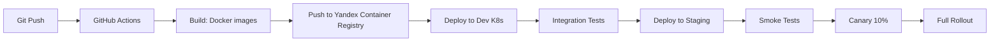
```mermaid
flowchart LR
    A[Git Push] --> B[GitHub Actions]
    B --> C[Build: Docker images]
    C --> D[Push to Yandex Container Registry]
    D --> E[Deploy to Dev K8s]
    E --> F[Integration Tests]
    F --> G[Deploy to Staging]
    G --> H[Smoke Tests]
    H --> I[Canary 10%]
    I --> J[Full Rollout]
```

---

## 9. Monitoring & Observability

### 9.1 Stack

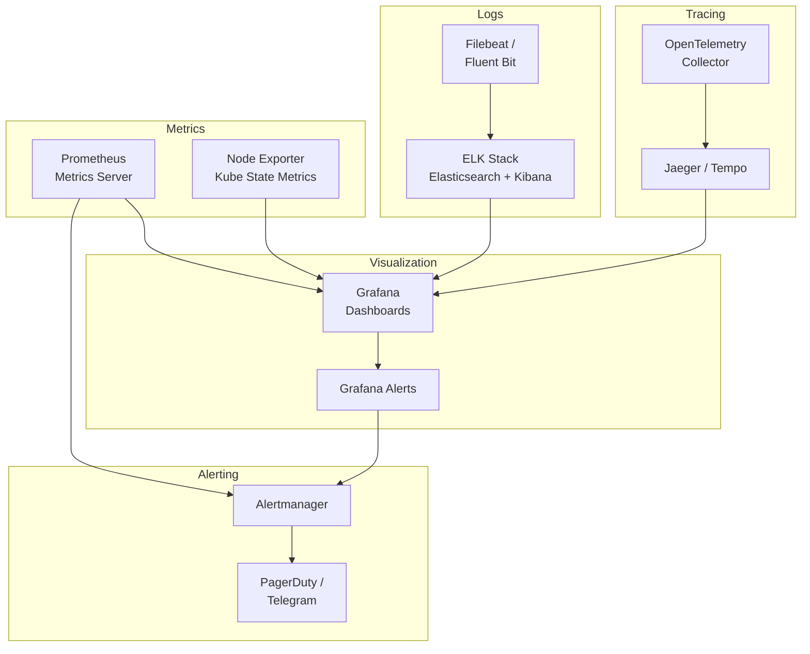
```mermaid
graph TB
    subgraph "Metrics"
        P1[Prometheus\nMetrics Server]
        P2[Node Exporter\nKube State Metrics]
    end

    subgraph "Logs"
        L1[Filebeat /\nFluent Bit]
        L2[ELK Stack\nElasticsearch + Kibana]
    end

    subgraph "Tracing"
        T1[OpenTelemetry\nCollector]
        T2[Jaeger / Tempo]
    end

    subgraph "Visualization"
        G1[Grafana\nDashboards]
        G2[Grafana Alerts]
    end

    subgraph "Alerting"
        A1[Alertmanager]
        A2[PagerDuty /\nTelegram]
    end

    P1 & P2 --> G1
    L1 --> L2 --> G1
    T1 --> T2 --> G1
    P1 --> A1 --> A2
    G1 --> G2 --> A1
```

### 9.2 Key Metrics

| Категория | Метрика | Источник | Порог тревоги |
|-----------|---------|----------|--------------|
| **LLM** | P50/P95/P99 latency | OpenTelemetry + Prometheus | >5s (P95) |
| **LLM** | Tokens/sec throughput | Prometheus | <10 tok/s |
| **LLM** | Error rate (4xx/5xx) | Prometheus | >1% |
| **LLM** | GPU utilization | DCGM Exporter | >90% → scale |
| **LLM** | Queue depth | Redis | >20 → scale |
| **API** | RPS per endpoint | Prometheus | — |
| **API** | Error rate per endpoint | Prometheus | >5% |
| **System** | CPU/Memory per pod | Kube State Metrics | >80% → HPA |
| **System** | Disk I/O | Node Exporter | >100 MB/s |
| **Business** | DAU/MAU | ClickHouse | — |
| **Business** | Daily cost by model | ClickHouse | — |
| **Business** | Tokens consumed | ClickHouse | — |

### 9.3 Grafana Dashboards

1. **LLM Performance Dashboard** — latency, throughput, error rate per model/provider
2. **GPU Dashboard** — utilization, memory, temperature, power per GPU (DCGM)
3. **Infrastructure Dashboard** — CPU/Memory/Disk per node, per pod, K8s events
4. **Business Dashboard** — DAU, cost, tokens by user/org/model
5. **RAG Dashboard** — retrieval latency, chunks retrieved, relevance scores
6. **Agent Dashboard** — agent execution times, tool call success rates, agent failures

### 9.4 Structured Logging

```json
{
  "timestamp": "2026-07-09T14:30:00.123Z",
  "level": "info",
  "service": "llm-router",
  "trace_id": "abc123def456",
  "span_id": "span789",
  "user_id": "user-uuid",
  "org_id": "org-uuid",
  "request": {
    "model": "yandexgpt/pro",
    "tokens_in": 245,
    "tokens_out": 1024,
    "latency_ms": 3420,
    "provider": "yandex",
    "cached": false
  },
  "response": {
    "status": "success",
    "finish_reason": "stop"
  },
  "cost": 0.0034
}
```

### 9.5 OpenTelemetry Instrumentation

```python
# Пример: instrumenting LLM Router
from opentelemetry import trace
from opentelemetry.instrumentation.requests import RequestsInstrumentor

tracer = trace.get_tracer(__name__)

with tracer.start_as_current_span("llm_inference") as span:
    span.set_attribute("model", model_name)
    span.set_attribute("tokens_in", tokens_in)
    span.set_attribute("provider", provider)

    # MLflow tracking
    mlflow.log_params({"model": model_name, "temperature": temperature})
    mlflow.log_metrics({"latency_ms": latency, "tokens_out": tokens_out})
```

---

## Приложение: Полная диаграмма компонентов (C4 Level 2)

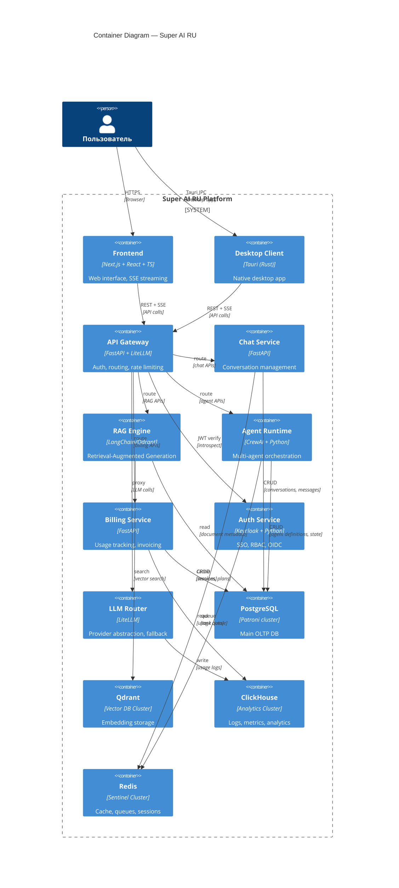
```mermaid
C4Container
  title Container Diagram — Super AI RU

  Person(user, "Пользователь")

  System_Boundary(superai, "Super AI RU Platform") {
    Container(fe, "Frontend", "Next.js + React + TS", "Web interface, SSE streaming")
    Container(desktop, "Desktop Client", "Tauri (Rust)", "Native desktop app")

    Container(gw, "API Gateway", "FastAPI + LiteLLM", "Auth, routing, rate limiting")

    Container(chat, "Chat Service", "FastAPI", "Conversation management")
    Container(rag, "RAG Engine", "LangChain/Qdrant", "Retrieval-Augmented Generation")
    Container(agent, "Agent Runtime", "CrewAI + Python", "Multi-agent orchestration")
    Container(billing, "Billing Service", "FastAPI", "Usage tracking, invoicing")

    Container(auth, "Auth Service", "Keycloak + Python", "SSO, RBAC, OIDC")
    Container(llm, "LLM Router", "LiteLLM", "Provider abstraction, fallback")

    Container(pg, "PostgreSQL", "Patroni cluster", "Main OLTP DB")
    Container(qdrant, "Qdrant", "Vector DB Cluster", "Embedding storage")
    Container(ch, "ClickHouse", "Analytics Cluster", "Logs, metrics, analytics")
    Container(redis, "Redis", "Sentinel Cluster", "Cache, queues, sessions")
  }

  Rel(user, fe, "HTTPS", "Browser")
  Rel(user, desktop, "Tauri IPC", "Desktop app")
  Rel(fe, gw, "REST + SSE", "API calls")
  Rel(desktop, gw, "REST + SSE", "API calls")

  Rel(gw, auth, "JWT verify", "introspect")
  Rel(gw, chat, "route", "chat APIs")
  Rel(gw, rag, "route", "RAG APIs")
  Rel(gw, agent, "route", "agent APIs")
  Rel(gw, billing, "route", "billing APIs")
  Rel(gw, llm, "proxy", "LLM calls")

  Rel(chat, pg, "CRUD", "conversations, messages")
  Rel(rag, qdrant, "search", "vector search")
  Rel(rag, pg, "read", "document metadata")
  Rel(agent, pg, "CRUD", "agent definitions, state")
  Rel(agent, redis, "queue", "task queue")
  Rel(billing, pg, "CRUD", "invoices, plans")
  Rel(billing, ch, "read", "usage data")
  Rel(llm, ch, "write", "usage logs")
  Rel(chat, redis, "cache", "sessions")
```

---

> **Документ поддерживается в актуальном состоянии.**  
> Последнее обновление: июль 2026  
> Автор: BROM AI / Ruslan Strogov